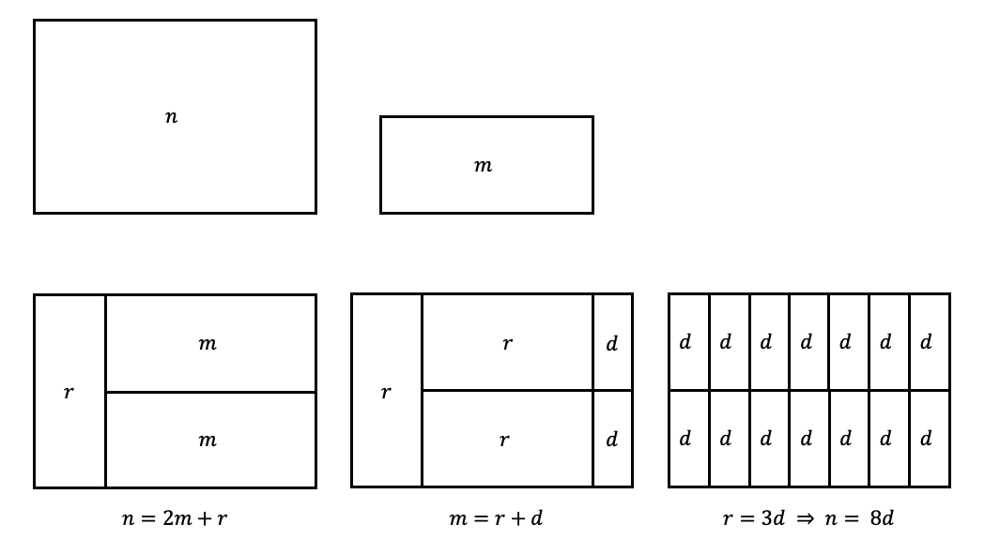

## Introduction
In our tutorial for algebra, we came across a very interesting problem - how does the Euclidean Algorithm work? 

Indeed, a lot of the time we just get taught the Euclidean Algorithm itself, how to implement it and what its proof is. In terms of intuitions, I just thought that it was magic. Okay, $\gcd(n,m) = \gcd(m,n \mod m)$. Another smart trick by Euclid. Done. 

The turning point began when I tried to link this with geometrical intuition.
## Will it fit? The Geometrical Intuition
Consider that we are finding $\gcd(n,m),\; n,m\in \mathbb{Z}$. Assume $n \ge m > 0$ throughout for the sake of simplicity. 

Consider a rectangle of area $n$ and another rectangle of area $m$. We do not need to care about the height or width in this method. We are trying to test whether multiple rectangles of area $m$ would fit exactly into the rectangle of area $n$. Note that we can adjust our height and width freely as long as we do not change the area. 

If a whole number of rectangles with area $m$ could fit into the big rectangle of area $n$ then we are done, as we have now proven that $m$ is a factor of $n$. This step is equivalent to this formula:
$$
n = mq + 0,\quad q\in\mathbb{N}
$$

If it does not, then it produces a "blank area" which it has not been filled in yet. Note this signifies the remainder, say $r$. We produce a rectangle of area $r$. This step is equivalent to this formula:
$$
n = mq + r,\quad 0 \le r < m
$$

As you might know, according to the Euclidean Algorithm, the next step should be finding $\gcd(m,r)$. We do the same step for this as well — find how many rectangles of area $r$ could fit in the big rectangle of area $m$. Do this recursively, until we reach the condition where the big rectangle can be filled by an exact number of small rectangles. As the rectangles were found on top of the remainder (rectangle), the final largest small rectangle we find (that will leave no remainder, aka space left) will automatically fit into the whole rectangle. The worst-case scenario is that it will be filled by rectangles with an area of 1, which will definitely work, as we are investigating natural numbers and no decimals are involved.

For example, such a diagram (not drawn to scale, for illustrative purposes) considers such a flow. Considering two rectangles, we start to see how many small rectangles the large rectangle can fit in. We do this recursively, and finally find out that the rectangles with area $d$, combining together, can fit in the bigger rectangle of area $n$ exactly.



## Code Implementation
Then I thought that it would be nice to use code to implement this idea, and also to check logically whether my idea was correct. Therefore, I write such code in Haskell to implement this idea:

```haskell
-- pre-condition: n >= m > 0
divi :: Int -> Int -> (Int,Int)
divi n m =
	go n m 1
		where
		go n m r
			| m*r < n = go n m (r+1)
			| m*r == n = (r,0)
			| otherwise = (r-1, n-m*(r-1))
-- post-condition: a tuple, first consisting of the factor and the second one consisting of the remainder

-- pre-condition: n>m
euc :: (Int, Int) -> Int
euc (n, m)
	| m == 0 = n
	| otherwise = let (_, r) = divi n m
				  in euc (m, r)
```

The first function is `divi`. This function receives the area of two rectangles, a big one and a small one, then finds how many small rectangles the big rectangles fit, with the spaces left. It does this recursively, by trial-and-error (moving forward one step if there may still be a room, and moving back if we have gone over). This is isomorphic to receiving two numbers and finding the factor and the remainder (i.e., it returns `(r,q)` in terms of $m=nq+r$). 

The second function is `euc`. It calls the `divi` function and tries to find the largest rectangle based on the remainder that could fit in the square for a whole number of times. This is isomorphic to the implementation of the Euclidean Algorithm.

Perhaps now the logic is evidently isomorphic to the implementation of the Euclidean Algorithm, thus it is true. However, let us still do a correctness proof.
### Correctness Proof
**Termination.** We prove `euc (n,m)` will definitely terminate. From the definition, we know that the factor is a number that is the remainder of a number that is definitely smaller than the number itself. From the precondition, we know that $n \geq m$. Thus, as the second component of the pair strictly decreases at every recursive step, and as the set of natural numbers is well-ordered without infinite descent, the second element in the input tuple will reach 0 at some point, thus terminating.

**Correctness.** We know that $\gcd(m,n)=\gcd(n,r)$ is correct for $n=km+r$ with $0 \leq r < m$. From the code and its postcondition, we know that such a construction calculates such a pair $(k,r)$. Since `divi` is exactly constructed that way, each recursive step preserves the gcd. We are done.

Maybe something we obtained from this proof is that the Euclidean Algorithm is fundamentally recursive, and is based on the well-ordering of natural numbers. This, again, in my opinion, highlights the beauty of the connection between Mathematics and Computer Science.

## Generalisation & Abstraction of this Method, and More
As this method does not require the length or the width of the rectangle, this leads me to think of an abstraction - can this be generalised to any other shapes? 

We can definitely generalise it to purely squares as well, considering that squares are considered a special case of rectangles. The shape that we have must be able to operate "cutting" and "adding" as well. I moved on, asking ChatGPT more about this, and the result was quite clear that I would need measure theory to finish this exploration.

As we can see, the issue with our Haskell code is that the time complexity of `divi` is $O(n)$. I left as it is now, as it is just a rough structure - but we can definitely optimise it while keeping the semantics, consider dynamically changing the steps we are taking each time!

Finally, Happy Chinese New Year! I personally have had a great but tiring Year of the Snake. Hope the Year of the Horse will treat all of us well.

祝大家马年大吉，万事如意，所有证明的Aha Moment都如期而至。

Hongwen Pu  
London, UK  
14th Feb 2026  

*Any Questions? Contact me via WeChat or Email! WeChat @ boypu123 (remark as "From the Blog" when adding as a friend); Email @ hongwen.pu@outlook.com or hongwen.pu.25@ucl.ac.uk.*
